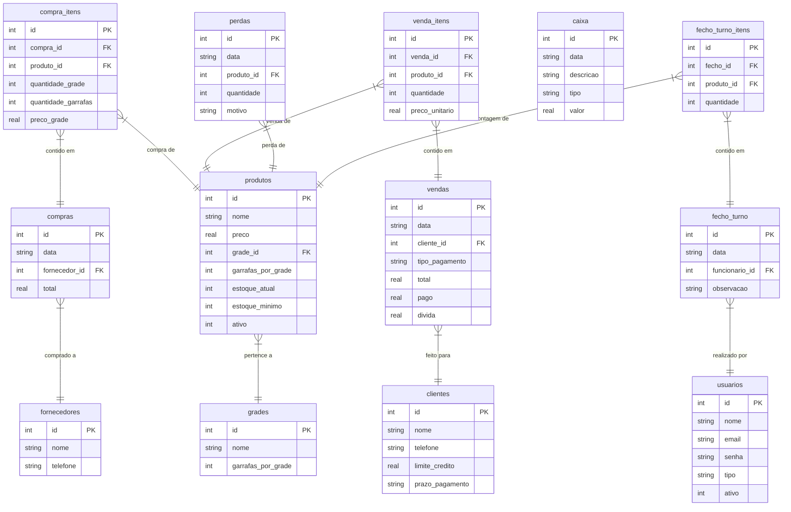

# Documentação Geral do Sistema — Bar Doce Lar

Esta documentação descreve a arquitetura, o banco de dados e as funcionalidades do sistema de gestão comercial e POS (Ponto de Venda) do **Bar Doce Lar**. O sistema foi desenhado para modernizar as operações diárias, controle de stock, fiados, reposições de grade/garrafa, auditoria de caixa e geração de relatórios fiscais oficiais.

---

## 1. Arquitetura Geral & Tecnologias
O sistema foi desenvolvido utilizando a seguinte pilha de tecnologia:
*   **Frontend & Backend:** [Next.js (App Router)](https://nextjs.org/) na versão 16.
*   **Base de Dados:** [SQLite](https://www.sqlite.org/) local via biblioteca síncrona de alta performance `better-sqlite3`.
*   **Ficheiro do Banco de Dados:** `bar_doce_lar.db` na raiz do projeto.
*   **Estilo Visual:** CSS Modules customizados com variáveis CSS modernas (Dark Mode por defeito, design com efeito de vidro/glassmorphism).
*   **Geração de PDFs:** `jspdf` e `jspdf-autotable` para exportações.

---

## 2. Diagrama da Base de Dados (Relacionamentos)

O seguinte diagrama Mermaid demonstra a estrutura e os relacionamentos das tabelas no SQLite (`lib/db.ts`):

---

## 3. Explicação Detalhada das Funcionalidades

### 3.1. Dashboard (Painel Principal)
*   **Objetivo:** Oferecer uma visão geral rápida do estado financeiro e de stock do dia.
*   **Métricas Exibidas:**
    *   **Vendas Hoje:** Soma das vendas efetuadas na data atual.
    *   **Total em Fiado:** Valor acumulado que o bar tem a receber de clientes devedores.
    *   **Estoque Baixo:** Alerta visual com contador de produtos cujo stock atual está abaixo do limite mínimo definido.
    *   **Clientes com Dívida:** Total de clientes com débitos ativos.
*   **Alertas Importantes:**
    *   **Prazos de Pagamento Vencidos:** Alerta quando clientes ultrapassam a data combinada de pagamento para as suas contas fiadas.
    *   **Fecho de Turno Recente:** Exibe os dados recolhidos pelo funcionário no último encerramento de caixa.

---

### 3.2. Ponto de Venda (POS)
*   **Objetivo:** Interface rápida de registo de vendas para o funcionário (caixa).
*   **Características:**
    *   Carrinho de compras interativo onde as bebidas podem ser adicionadas com um clique.
    *   Cálculo automático de descontos por quantidade (ex.: cervejas que saem com promoção "3 por 1000 Kz" em vez de preço individual).
    *   **Métodos de Pagamento:**
        1.  **Dinheiro:** Registado e contabilizado imediatamente no caixa do dia.
        2.  **Multicaixa (Transferência/TPA):** Entrada eletrónica direta.
        3.  **Fiado:** Permite selecionar um cliente registado. O sistema verifica se o limite de crédito do cliente não foi ultrapassado antes de autorizar a venda.
    *   **Atualização em Tempo Real:** Dedução instantânea de garrafas do stock atual da base de dados ao finalizar a venda.

---

### 3.3. Gestão de Estoque (Inventário)
*   **Objetivo:** Controle total do catálogo de produtos e dos níveis de armazenamento.
*   **Funcionalidades:**
    *   **Visualização Conversível:** Converte garrafas individuais em grades completas (ex.: se um produto tem 48 garrafas na base de dados e a grade é de 24, exibe `2 cx + 0 un`).
    *   **Adicionar Estoque Manual:** Permite que o administrador adicione entradas de garrafas no stock sem gerar uma compra formal.
    *   **Registar Perda:** Permite registar perdas físicas de produtos (quebras de garrafas, prazos expirados) para justificar quebras de stock.
    *   **Preços Dinâmicos & Promoções:** Definição do preço padrão e criação de tabelas de preços por lote/quantidade (ex: Leve 3, pague X).
    *   **Filtro Ativo/Inativo:** Exclusão lógica (soft-delete) que mantém o histórico de vendas antigas intacto, mas impede que produtos velhos apareçam nas telas de POS, Compras ou Estoque.

---

### 3.4. Compras (Entrada de Mercadorias)
*   **Objetivo:** Registar as recargas e aquisições de produtos junto de fornecedores.
*   **Características:**
    *   Entrada de stock especificada em grades e/ou garrafas avulsas.
    *   O sistema multiplica automaticamente o número de grades pela quantidade padrão de garrafas daquela marca para somar ao stock físico total.
    *   Vinculação a um fornecedor registado para rastreabilidade de custos.

---

### 3.5. Fecho de Turno
*   **Objetivo:** Garantir a honestidade operacional e a contagem física no final de cada dia/turno de trabalho.
*   **Fluxo:**
    1.  O funcionário entra na secção de Fecho de Turno antes de ir embora.
    2.  O sistema exibe o formulário de contagem com os produtos ativos.
    3.  O funcionário introduz a quantidade física exata que sobrou na **Prateleira** e na **Arca** (geladeira/congelador).
    4.  Ao submeter, os valores são registados no histórico. O Administrador pode posteriormente comparar o estoque do sistema (teórico) com a contagem manual do funcionário para identificar desvios (bebidas não pagas ou furtos).

---

### 3.6. Clientes e Dívidas (Controle de Fiado)
*   **Objetivo:** Mitigar riscos de inadimplência no bar.
*   **Funcionalidades:**
    *   Registo de clientes com nome, telefone, limite máximo de fiado e prazo limite de pagamento.
    *   Se o cliente tentar comprar fiado acima do seu limite configurado, o POS bloqueia a finalização da transação.
    *   Amortização parcial ou total da dívida através do ecrã de detalhes do cliente (ex.: cliente paga 2.000 Kz da sua conta de 5.000 Kz).

---

### 3.7. Relatórios & Fecho de Caixa Oficial
*   **Objetivo:** Permitir ao administrador obter balanços detalhados e exportar folhas de controle administrativo.
*   **Tipos de Exportações PDF:**
    1.  **Relatório Diário de Caixa:** Um resumo rápido de entradas, despesas manuais do dia (ex.: pagamento de gelo, energia) e lucro líquido em caixa.
    2.  **Folha de Controle em Branco (Modelo Oficial):** PDF de 12 colunas formatado no padrão clássico do Bar Doce Lar, impresso limpo para preenchimento a caneta pelos funcionários.
    3.  **Relatório Oficial Preenchido:** PDF de 12 colunas preenchido automaticamente, computando stock inicial, sobras de contagem física (fecho de turno), vendas a pronto, vendas a prazo, quebras/perdas e total financeiro do dia.

---

## 4. Níveis de Acesso (Permissões)

O sistema divide as permissões com base no tipo de utilizador armazenado no cookie de sessão:

| Funcionalidade | Administrador (Admin) | Funcionário (Func) |
| :--- | :---: | :---: |
| **Registrar Vendas (POS)** | Sim | Sim |
| **Efetuar Fecho de Turno** | Não (Redirecionado) | Sim |
| **Gerir Estoque (Criar/Editar/Eliminar)** | Sim | Apenas Leitura |
| **Registar Perdas / Adicionar Stock** | Sim | Não |
| **Registar Compras de Fornecedores** | Sim | Não |
| **Descarregar Relatório Oficial 12 Colunas** | Sim | Não |
| **Configurações Globais do Sistema** | Sim | Não |
| **Gerir Contas de Funcionários** | Sim | Não |
| **Eliminar Vendas do Histórico** | Sim | Não |

---

## 5. Como Executar e Manter
1.  **Instalar dependências:** `npm install`
2.  **Iniciar base de dados e migrações:** Ocorre de forma totalmente automática na inicialização da aplicação através do script `lib/db.ts`.
3.  **Ambiente de desenvolvimento:** `npm run dev`
4.  **Compilar para produção:** `npm run build`
